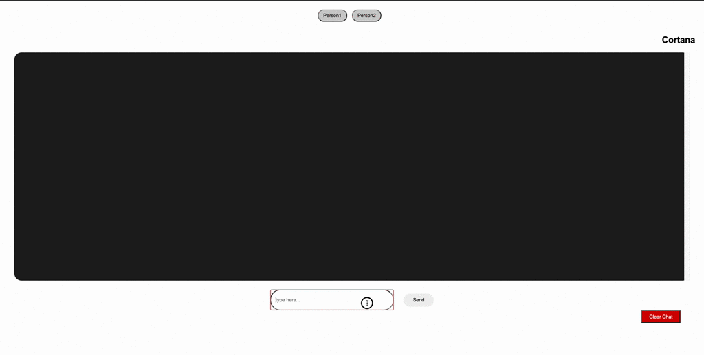

# 상태 관리를 위한 React Hooks 가 있는 RxJS

## 개요

  rxjs + react + hook + typescript 을 이용한 상태관리 예제
  
  

- [참고 : (https://blog.logrocket.com/rxjs-with-react-hooks-for-state-management/)](https://blog.logrocket.com/rxjs-with-react-hooks-for-state-management/)
